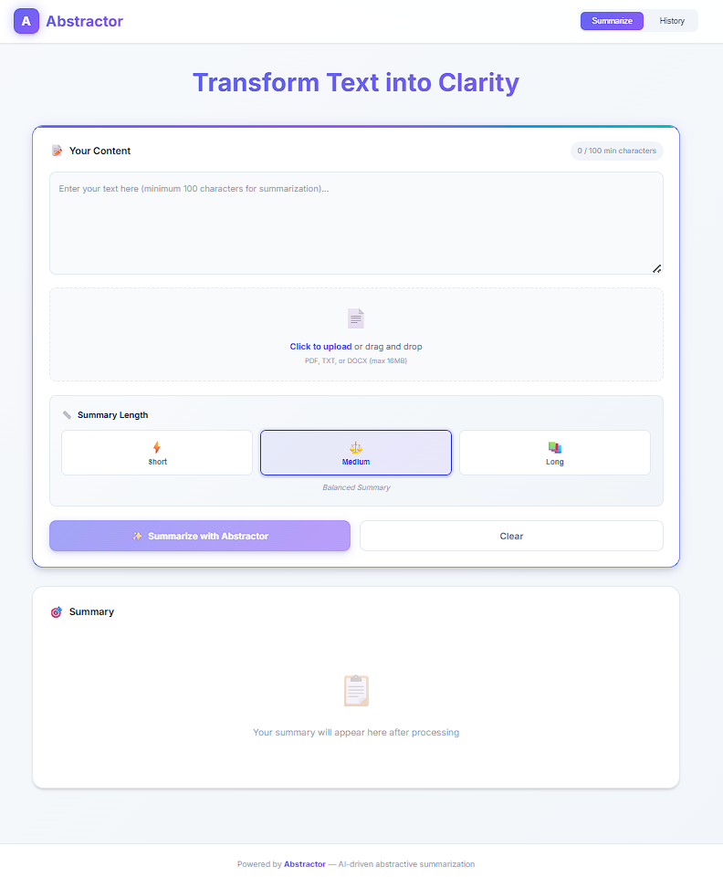

# Abstractor AI 📄✨

**AI-Powered Document Summarization Platform**

Abstractor AI is an intelligent document summarization system that leverages advanced Natural Language Processing (NLP) to convert lengthy documents into concise, meaningful summaries. Built with a modern full-stack architecture, it supports multiple file formats and provides customizable summary lengths.



## 🌟 Features

### Core Capabilities
- **📄 Multi-Format Support**: Upload and process PDF, DOCX, and TXT files
- **🤖 Advanced AI Summarization**: Powered by Facebook's BART-large-CNN model via Hugging Face API
- **⚙️ Customizable Length**: Choose from short, medium, or long summaries based on your needs
- **💾 Summary History**: Access and review previously generated summaries
- **🎨 Modern UI**: Clean, intuitive interface built with React
- **🔒 Secure Processing**: Files are processed in-memory without permanent storage

### Technical Highlights
- **Backend**: Flask REST API with CORS support
- **Frontend**: React 19 with Vite for fast development
- **Text Processing**: Intelligent text chunking algorithm for optimal summarization
- **File Handling**: Support for up to 16MB file uploads
- **Responsive Design**: Works seamlessly across devices

## 🏗️ Architecture

Abstractor AI uses a client-server architecture:

```
┌─────────────────┐         ┌──────────────────┐         ┌─────────────────────┐
│   React Client  │ ◄────►  │   Flask Backend  │ ◄────►  │  Hugging Face API   │
│   (Vite + Axios)│         │  (Python/Flask)  │         │  (BART-large-CNN)   │
└─────────────────┘         └──────────────────┘         └─────────────────────┘
        │                           │                              │
        │    HTTP Requests          │    Text Extraction           │    AI Model
        │    (JSON)                 │    (PDF/DOCX/TXT)            │    Inference
        ▼                           ▼                              ▼
```

## 🚀 Getting Started

### Prerequisites

- **Node.js** (v18 or higher)
- **Python** (v3.8 or higher)
- **Hugging Face API Token** (free account required)

### Installation

#### 1. Clone the Repository

```bash
git clone https://github.com/SyedMafaaz/Abstractor-AI.git
cd Abstractor-AI
```

#### 2. Install Backend Dependencies

```bash
pip install -r requirements.txt
```

**Requirements:**
- `flask>=3.0.0` - Web framework
- `flask-cors>=4.0.0` - Cross-Origin Resource Sharing
- `pypdf2>=3.0.0` - PDF text extraction
- `python-docx>=1.0.0` - DOCX text extraction
- `requests>=2.31.0` - HTTP client for API calls
- `gunicorn>=21.0.0` - Production WSGI server

#### 3. Install Frontend Dependencies

```bash
npm install
```

#### 4. Configure Environment

Set your Hugging Face API token as an environment variable:

**Windows (PowerShell):**
```powershell
$env:HF_API_TOKEN="your_token_here"
```

**Linux/Mac:**
```bash
export HF_API_TOKEN="your_token_here"
```

Get your free API token at: [https://huggingface.co/settings/tokens](https://huggingface.co/settings/tokens)

### Running the Application

#### Start the Backend Server

```bash
cd backend
python app.py
```

The Flask server will start on `http://localhost:5000`

#### Start the Frontend Development Server

```bash
npm run dev
```

The React app will start on `http://localhost:5173` (or next available port)

### Building for Production

```bash
npm run build
```

Production files will be generated in the `dist/` directory.

## 📖 How It Works

### Document Processing Flow

1. **File Upload**: User uploads PDF, DOCX, or TXT file through the web interface
2. **Text Extraction**: Backend extracts text using format-specific parsers
3. **Text Chunking**: Long documents are intelligently split into manageable chunks
4. **API Processing**: Each chunk is sent to BART-large-CNN model for summarization
5. **Summary Assembly**: Individual summaries are combined and formatted
6. **Display**: Final summary is presented to the user with copy functionality

### Text Chunking Algorithm

For documents exceeding model input limits, the system uses an intelligent chunking strategy:

- Splits text into overlapping segments at sentence boundaries
- Maintains context continuity between chunks
- Optimizes chunk size for model performance
- Reassembles partial summaries coherently

## 🎯 Usage Examples

### Supported File Formats

| Format | Extension | Max Size |
|--------|---------|----------|
| PDF | `.pdf` | 16 MB |
| Word Document | `.docx` | 16 MB |
| Plain Text | `.txt` | 16 MB |

### Summary Length Options

- **Short**: ~2 sentences, 80 tokens (quick overview)
- **Medium**: ~4 sentences, 150 tokens (detailed summary)
- **Long**: ~6 sentences, 250 tokens (comprehensive analysis)

## 📁 Project Structure

```
Abstractor-AI/
├── backend/
│   └── app.py              # Flask API server
├── client/
│   ├── src/
│   │   ├── App.jsx         # Main React component
│   │   ├── index.css       # Global styles
│   │   └── main.jsx        # React entry point
│   ├── public/
│   │   └── favicon.svg     # Site favicon
│   └── index.html          # HTML template
├── images/                  # Documentation images
│   ├── homepage.png
│   ├── summary.png
│   ├── history.png
│   └── [more diagrams...]
├── .gitignore
├── package.json            # Node.js dependencies
├── requirements.txt        # Python dependencies
├── vite.config.js          # Vite configuration
└── README.md               # This file
```

## 🔬 Technology Stack

### Backend
- **Framework**: Flask 3.0+
- **NLP Model**: Facebook BART-large-CNN
- **API**: Hugging Face Inference API
- **File Processing**: PyPDF2, python-docx
- **Deployment**: Gunicorn WSGI server

### Frontend
- **Library**: React 19
- **Build Tool**: Vite 7
- **HTTP Client**: Axios
- **Styling**: Custom CSS with modern design

## 🛠️ Development

### Available Scripts

**Frontend:**
- `npm run dev` - Start development server
- `npm run build` - Build for production
- `npm run preview` - Preview production build

**Backend:**
- `python app.py` - Run Flask development server
- `gunicorn app:app` - Run with production server

### Adding New Features

To extend the application:

1. **New File Formats**: Add extraction functions in `backend/app.py`
2. **Custom Models**: Update `HF_API_URL` to use different models
3. **UI Enhancements**: Modify components in `client/src/App.jsx`

## 📊 Performance

- **Processing Speed**: ~2-5 seconds for average documents
- **Maximum File Size**: 16 MB
- **Concurrent Users**: Supports multiple simultaneous requests
- **Model Accuracy**: BART-large-CNN achieves state-of-the-art ROUGE scores

## 🔐 Security Considerations

- Files are processed in-memory (no disk storage)
- Automatic cleanup after processing
- CORS configured for controlled access
- File type validation before processing
- Size limits enforced at server level

## 🐛 Troubleshooting

### Common Issues

**1. API Rate Limiting**
- Hugging Face free tier has rate limits
- Solution: Upgrade to paid plan or implement request queuing

**2. Large File Errors**
- Files over 16MB will be rejected
- Solution: Compress PDFs or split large documents

**3. CORS Errors**
- Ensure backend server is running
- Check CORS configuration in `app.py`

**4. Model Loading Issues**
- Verify API token is set correctly
- Check internet connectivity

## 🤝 Contributing

Contributions are welcome! To contribute:

1. Fork the repository
2. Create a feature branch (`git checkout -b feature/AmazingFeature`)
3. Commit your changes (`git commit -m 'Add AmazingFeature'`)
4. Push to the branch (`git push origin feature/AmazingFeature`)
5. Open a Pull Request

## 📄 License

This project is open source and available under the MIT License.

## 👥 Author

**Syed Mafaaz**

GitHub: [@SyedMafaaz](https://github.com/SyedMafaaz)

## 🙏 Acknowledgments

- **Facebook AI Research** for BART-large-CNN model
- **Hugging Face** for inference API infrastructure
- **React and Flask communities** for excellent frameworks

## 📞 Support

For issues, questions, or suggestions:
- Open an issue on GitHub
- Contact: syedmafaaz@example.com

## 🔮 Future Enhancements

Planned features for upcoming versions:

- [ ] User authentication and accounts
- [ ] Cloud storage integration (AWS S3, Google Drive)
- [ ] Multiple language support
- [ ] Custom model fine-tuning
- [ ] Batch processing
- [ ] Export summaries to multiple formats
- [ ] Real-time collaboration features
- [ ] Mobile application

---

**Made with ❤️ using AI and Modern Web Technologies**

*Last Updated: March 2026*
